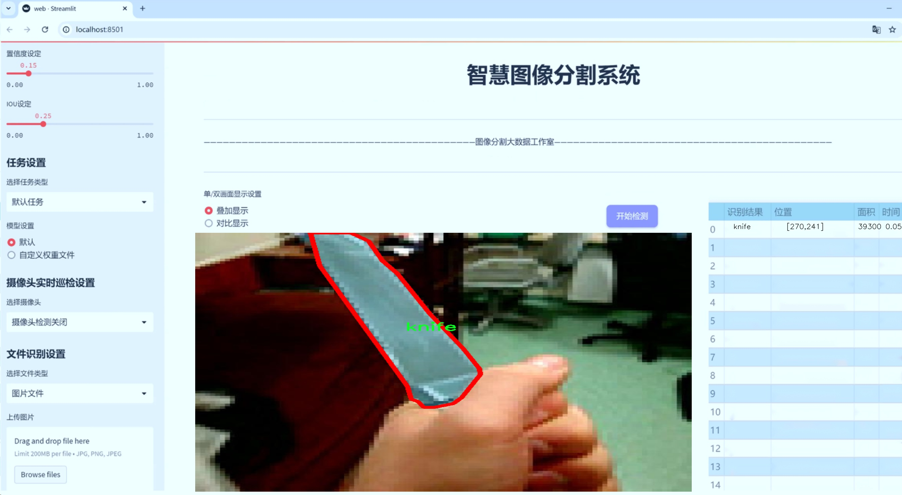
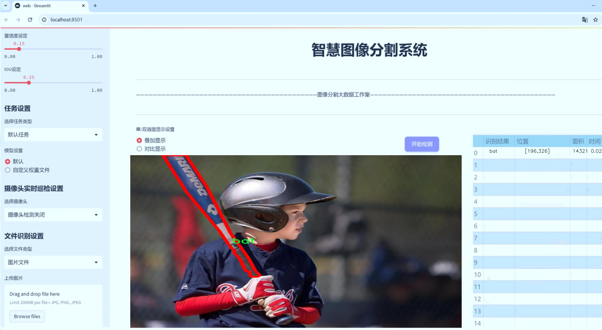
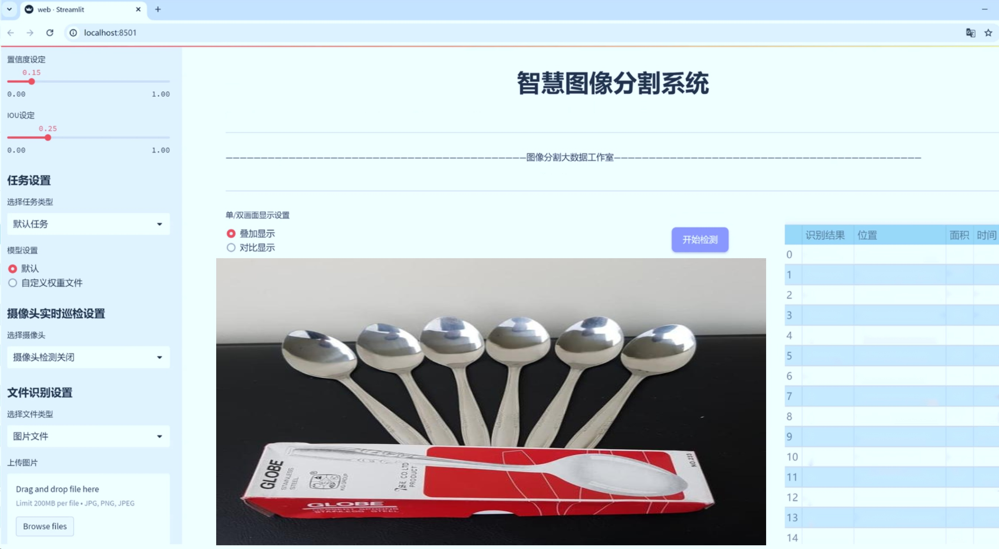
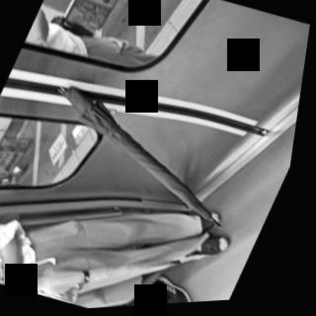
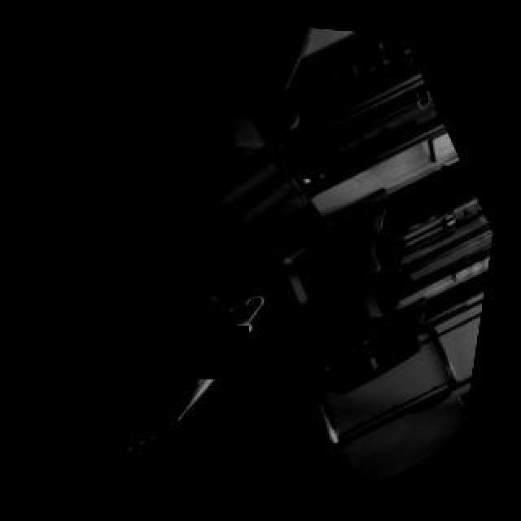
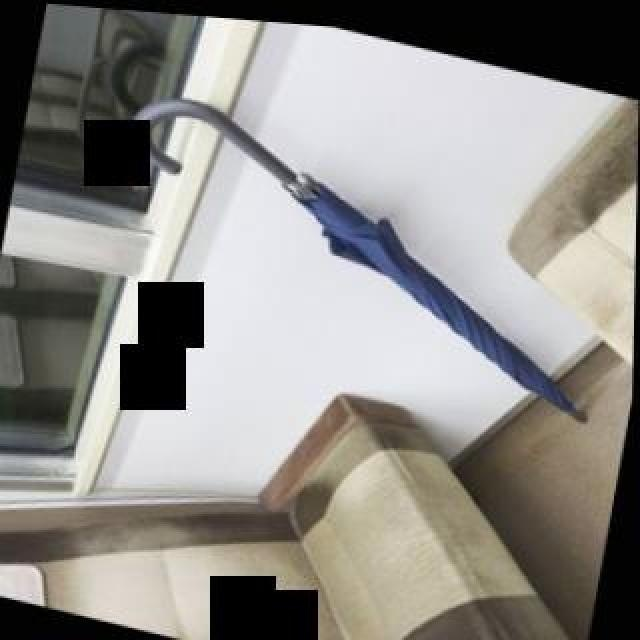

# 危险物品图像分割系统源码＆数据集分享
 [yolov8-seg-GFPN＆yolov8-seg-CSwinTransformer等50+全套改进创新点发刊_一键训练教程_Web前端展示]

### 1.研究背景与意义

项目参考[ILSVRC ImageNet Large Scale Visual Recognition Challenge](https://gitee.com/YOLOv8_YOLOv11_Segmentation_Studio/projects)

项目来源[AAAI Global Al lnnovation Contest](https://kdocs.cn/l/cszuIiCKVNis)

研究背景与意义

随着科技的迅猛发展，智能监控与安全防范系统在各个领域中扮演着越来越重要的角色。尤其是在公共安全、工业生产及交通管理等领域，危险物品的及时识别与处理显得尤为关键。传统的危险物品检测方法往往依赖于人工监控，效率低下且容易受到人为因素的影响，难以满足现代社会对安全防范的高要求。因此，基于深度学习的图像分割技术应运而生，成为提升危险物品识别效率与准确性的有效手段。

YOLO（You Only Look Once）系列模型因其实时性和高精度而广受欢迎。YOLOv8作为该系列的最新版本，结合了多种先进的深度学习技术，具备了更强的特征提取能力和更快的推理速度。然而，尽管YOLOv8在目标检测方面表现出色，但在复杂场景下的危险物品图像分割任务中仍然存在一定的局限性。因此，改进YOLOv8以适应危险物品图像分割的需求，具有重要的研究价值和实际意义。

本研究基于一个包含2700张图像的数据集，专注于三类危险物品的实例分割：蝙蝠、锤子和刀具。这些物品在日常生活中相对常见，但在特定场景下却可能成为潜在的安全隐患。通过对这些物品进行精准的图像分割，可以为后续的危险物品检测、分类和处理提供重要的基础数据。这不仅有助于提升监控系统的智能化水平，还能有效降低人为失误带来的安全风险。

在数据集的构建上，包含的三类物品各具特征，具有一定的代表性和多样性。蝙蝠的形态较为复杂，锤子和刀具则在形状和边缘特征上有明显的差异。这为模型的训练和测试提供了丰富的样本，有助于提高模型的泛化能力和鲁棒性。此外，针对这些物品的实例分割任务，可以深入研究不同物品在图像中的遮挡、重叠等复杂情况，进一步推动图像分割技术的发展。

通过改进YOLOv8的结构和算法，本研究旨在提升其在危险物品图像分割任务中的表现，探索更高效的特征提取方法和优化策略。研究成果不仅能够为智能监控系统的开发提供理论支持，还可以为实际应用中的危险物品识别与处理提供技术保障。这对于提升公共安全、保障人们的生命财产安全具有重要的现实意义。

综上所述，基于改进YOLOv8的危险物品图像分割系统的研究，不仅是对现有技术的有益补充，更是推动智能监控与安全防范领域发展的重要一步。通过深入探索和研究，期望能够为未来的安全技术创新提供新的思路和方法，促进社会的安全与稳定。

### 2.图片演示







##### 注意：由于此博客编辑较早，上面“2.图片演示”和“3.视频演示”展示的系统图片或者视频可能为老版本，新版本在老版本的基础上升级如下：（实际效果以升级的新版本为准）

  （1）适配了YOLOV8的“目标检测”模型和“实例分割”模型，通过加载相应的权重（.pt）文件即可自适应加载模型。

  （2）支持“图片识别”、“视频识别”、“摄像头实时识别”三种识别模式。

  （3）支持“图片识别”、“视频识别”、“摄像头实时识别”三种识别结果保存导出，解决手动导出（容易卡顿出现爆内存）存在的问题，识别完自动保存结果并导出到tempDir中。

  （4）支持Web前端系统中的标题、背景图等自定义修改，后面提供修改教程。

  另外本项目提供训练的数据集和训练教程,暂不提供权重文件（best.pt）,需要您按照教程进行训练后实现图片演示和Web前端界面演示的效果。

### 3.视频演示

[3.1 视频演示](https://www.bilibili.com/video/BV1kP1YYEEQB/)

### 4.数据集信息展示

##### 4.1 本项目数据集详细数据（类别数＆类别名）

nc: 3
names: ['bat', 'hammer', 'knife']


##### 4.2 本项目数据集信息介绍

数据集信息展示

在现代计算机视觉领域，尤其是在物体检测与图像分割任务中，数据集的质量和多样性直接影响到模型的性能与应用效果。本研究所使用的数据集名为“danger segmentation”，专门用于训练和改进YOLOv8-seg模型，以实现对危险物品的高效图像分割。该数据集的设计初衷是为了提升计算机在识别和分割潜在危险物品方面的能力，进而为安全监控、公共安全等领域提供更为精准的技术支持。

“danger segmentation”数据集包含三种类别的危险物品，分别是“bat”（球棒）、“hammer”（锤子）和“knife”（刀具）。这些物品在日常生活中虽然常见，但在特定情境下可能会被用作攻击工具，因此其识别与分割显得尤为重要。数据集中每个类别的样本数量经过精心挑选，以确保模型在训练过程中能够接触到足够多样化的实例，从而提高其泛化能力和鲁棒性。

在数据集的构建过程中，研究团队采用了多种数据采集和标注技术，以确保每个类别的图像都具备高质量的标注信息。图像来源涵盖了不同的场景和背景，以模拟真实世界中可能遇到的各种情况。这种多样性不仅有助于模型学习到更为全面的特征，也为后续的测试和验证提供了坚实的基础。此外，数据集中的图像经过精细的预处理，包括去噪、增强和标准化，以提升图像质量并增强模型的训练效果。

为了进一步提升数据集的实用性，研究团队还考虑了数据集的可扩展性和可迁移性。随着技术的不断进步和应用场景的不断扩展，未来可能会有更多的危险物品被纳入到数据集中。因此，数据集的设计采用了模块化的结构，便于后续添加新类别和样本。同时，数据集的标注格式与主流深度学习框架兼容，使得研究人员能够轻松地将其应用于不同的模型训练任务中。

在进行YOLOv8-seg模型的训练时，研究团队将“danger segmentation”数据集划分为训练集、验证集和测试集，以确保模型的训练过程能够得到充分的评估与优化。通过在不同数据集上的表现，研究人员能够实时监控模型的学习进度，并根据反馈调整训练策略，从而实现最佳的分割效果。

总之，“danger segmentation”数据集不仅为YOLOv8-seg模型的训练提供了丰富的样本和标注信息，也为后续的研究与应用奠定了坚实的基础。随着该数据集的深入应用，期望能够在危险物品的识别与分割领域取得更为显著的进展，为社会安全提供更为可靠的技术保障。








### 5.全套项目环境部署视频教程（零基础手把手教学）

[5.1 环境部署教程链接（零基础手把手教学）](https://www.bilibili.com/video/BV1jG4Ve4E9t/?vd_source=bc9aec86d164b67a7004b996143742dc)


[5.2 安装Python虚拟环境创建和依赖库安装视频教程链接（零基础手把手教学）](https://www.bilibili.com/video/BV1nA4VeYEze/?vd_source=bc9aec86d164b67a7004b996143742dc)

### 6.手把手YOLOV8-seg训练视频教程（零基础小白有手就能学会）

[6.1 手把手YOLOV8-seg训练视频教程（零基础小白有手就能学会）](https://www.bilibili.com/video/BV1cA4VeYETe/?vd_source=bc9aec86d164b67a7004b996143742dc)


按照上面的训练视频教程链接加载项目提供的数据集，运行train.py即可开始训练



     Epoch   gpu_mem       box       obj       cls    labels  img_size
     1/200     0G   0.01576   0.01955  0.007536        22      1280: 100%|██████████| 849/849 [14:42<00:00,  1.04s/it]
               Class     Images     Labels          P          R     mAP@.5 mAP@.5:.95: 100%|██████████| 213/213 [01:14<00:00,  2.87it/s]
                 all       3395      17314      0.994      0.957      0.0957      0.0843

     Epoch   gpu_mem       box       obj       cls    labels  img_size
     2/200     0G   0.01578   0.01923  0.007006        22      1280: 100%|██████████| 849/849 [14:44<00:00,  1.04s/it]
               Class     Images     Labels          P          R     mAP@.5 mAP@.5:.95: 100%|██████████| 213/213 [01:12<00:00,  2.95it/s]
                 all       3395      17314      0.996      0.956      0.0957      0.0845

     Epoch   gpu_mem       box       obj       cls    labels  img_size
     3/200     0G   0.01561    0.0191  0.006895        27      1280: 100%|██████████| 849/849 [10:56<00:00,  1.29it/s]
               Class     Images     Labels          P          R     mAP@.5 mAP@.5:.95: 100%|███████   | 187/213 [00:52<00:00,  4.04it/s]
                 all       3395      17314      0.996      0.957      0.0957      0.0845


### 7.50+种全套YOLOV8-seg创新点代码加载调参视频教程（一键加载写好的改进模型的配置文件）

[7.1 50+种全套YOLOV8-seg创新点代码加载调参视频教程（一键加载写好的改进模型的配置文件）](https://www.bilibili.com/video/BV1Hw4VePEXv/?vd_source=bc9aec86d164b67a7004b996143742dc)

### 8.YOLOV8-seg图像分割算法原理

原始YOLOv8-seg算法原理

YOLOv8-seg算法是YOLO系列中的一个重要进展，结合了目标检测与图像分割的能力，旨在提供更高效且精确的视觉理解。该算法由Ultralytics团队在2023年发布，基于YOLOv5的架构，吸收了近两年内在目标检测领域的多项先进技术和改进，尤其是在处理复杂场景和小目标检测方面的表现得到了显著提升。

YOLOv8-seg的网络结构主要由输入层、主干网络、颈部网络和输出层四个部分组成。输入层负责对输入图像进行预处理，采用了Mosaic数据增强技术，这种方法通过将多张图像拼接在一起，形成新的训练样本，极大地提高了模型的鲁棒性和泛化能力。然而，YOLOv8在训练的最后10个epoch中停止使用Mosaic增强，以减少对数据真实分布的干扰，确保模型能够更好地学习到目标的真实特征。

在主干网络部分，YOLOv8-seg引入了C2f模块，这一模块是对YOLOv5中C3模块的改进，灵感来源于YOLOv7中的ELAN设计。C2f模块通过增加跳层连接，丰富了梯度流的信息，增强了特征提取的能力，同时保持了模型的轻量化。SPPF（Spatial Pyramid Pooling Fast）模块依然被保留，以提高特征提取的效率和速度。

颈部网络是YOLOv8-seg的另一大亮点。与YOLOv5不同，YOLOv8在颈部网络中将所有的C3模块替换为C2f模块，并且去除了上采样之前的卷积连接层。这一改动使得特征融合过程更加高效，能够更好地整合来自不同尺度的特征图，从而提高模型对多尺度目标的检测能力。

在输出层，YOLOv8-seg采用了解耦头（Decoupled Head）的设计思路，分别处理目标的分类和定位任务。通过将这两个任务解耦，模型能够更专注于每个任务的特征提取，从而提高了收敛速度和预测精度。YOLOv8-seg使用了无锚框（Anchor-Free）的方法，直接预测目标的中心点，并引入了任务对齐学习（Task Alignment Learning, TAL）来优化正负样本的区分。这种方法使得模型在处理复杂场景时，能够更好地应对目标位置的变化和类别的多样性。

在损失函数的设计上，YOLOv8-seg结合了分类分数和IoU（Intersection over Union）的高次幂乘积，作为衡量任务对齐程度的指标。这一创新使得模型在优化过程中，能够同时关注分类和定位的准确性，进一步提升了检测性能。具体而言，分类损失采用了二元交叉熵损失（Binary Cross-Entropy Loss），而回归损失则使用了分布焦点损失（Distribution Focal Loss）和完全交并比损失（Complete Intersection over Union Loss），以确保模型能够快速聚焦于标签附近的区域。

YOLOv8-seg在目标检测和图像分割的任务中展现出了优越的性能，尤其是在COCO数据集上的表现尤为突出。其mAP（mean Average Precision）指标在同类模型中处于领先地位，且在推理速度上也表现出色。这使得YOLOv8-seg不仅适用于静态图像的处理，也能够在实时应用中保持高效的性能，满足了现代计算机视觉任务对速度和准确性的双重需求。

总的来说，YOLOv8-seg算法通过一系列结构上的创新和优化，克服了传统目标检测算法在复杂场景和小目标检测中的不足。其无锚框的设计、解耦头的结构以及任务对齐学习的引入，使得YOLOv8-seg在实际应用中展现出了更强的适应性和更高的精度。这些改进不仅提升了模型的性能，也为未来的研究提供了新的思路和方向。随着YOLOv8-seg的广泛应用，计算机视觉领域的许多实际问题将有望得到更有效的解决。


### 9.系统功能展示（检测对象为举例，实际内容以本项目数据集为准）

图9.1.系统支持检测结果表格显示

  图9.2.系统支持置信度和IOU阈值手动调节

  图9.3.系统支持自定义加载权重文件best.pt(需要你通过步骤5中训练获得)

  图9.4.系统支持摄像头实时识别

  图9.5.系统支持图片识别

  图9.6.系统支持视频识别

  图9.7.系统支持识别结果文件自动保存

  图9.8.系统支持Excel导出检测结果数据


### 10.50+种全套YOLOV8-seg创新点原理讲解（非科班也可以轻松写刊发刊，V11版本正在科研待更新）

#### 10.1 由于篇幅限制，每个创新点的具体原理讲解就不一一展开，具体见下列网址中的创新点对应子项目的技术原理博客网址【Blog】：


[10.1 50+种全套YOLOV8-seg创新点原理讲解链接](https://gitee.com/qunmasj/good)

#### 10.2 部分改进模块原理讲解(完整的改进原理见上图和技术博客链接)【如果此小节的图加载失败可以通过CSDN或者Github搜索该博客的标题访问原始博客，原始博客图片显示正常】
### YOLOv8算法原理
YOLOv8算法由Glenn-Jocher 提出，是跟YOLOv3算法、YOLOv5算法一脉相承的，主要的改进点如下:
(1)数据预处理。YOLOv8的数据预处理依旧采用YOLOv5的策略,在训练时，主要采用包括马赛克增强(Mosaic)、混合增强(Mixup)、空间扰动(randomperspective)以及颜色扰动(HSV augment)四个增强手段。
(2)骨干网络结构。YOLOv8的骨干网络结构可从YOLOv5略见一斑，YOLOv5的主干网络的架构规律十分清晰，总体来看就是每用一层步长为2的3×3卷积去降采样特征图，接一个C3模块来进一步强化其中的特征，且C3的基本深度参数分别为“3/6/9/3”，其会根据不同规模的模型的来做相应的缩放。在的YOLOv8中，大体上也还是继承了这一特点，原先的C3模块均被替换成了新的C2f模块，C2f 模块加入更多的分支，丰富梯度回传时的支流。下面展示了YOLOv8的C2f模块和YOLOv5的C3模块，其网络结构图所示。


(3)FPN-PAN结构。YOLOv8仍采用FPN+PAN结构来构建YOLO的特征金字塔，使多尺度信息之间进行充分的融合。除了FPN-PAN里面的C3模块被替换为C2f模块外，其余部分与YOLOv5的FPN-PAN结构基本一致。
(4)Detection head结构。从 YOLOv3到 YOLOv5，其检测头一直都是“耦合”(Coupled)的,即使用一层卷积同时完成分类和定位两个任务，直到YOLOX的问世， YOLO系列才第一次换装“解耦头”(Decoupled Head)。YOLOv8也同样也采用了解耦头的结构，两条并行的分支分别取提取类别特征和位置特征，然后各用一层1x1卷积完成分类和定位任务。YOLOv8整体的网络结构由图所示。


(5)标签分配策略。尽管YOLOv5设计了自动聚类候选框的一些功能，但是聚类候选框是依赖于数据集的。若数据集不够充分，无法较为准确地反映数据本身的分布特征，聚类出来的候选框也会与真实物体尺寸比例悬殊过大。YOLOv8没有采用候选框策略，所以解决的问题就是正负样本匹配的多尺度分配。不同于YOLOX所使用的 SimOTA，YOLOv8在标签分配问题上采用了和YOLOv6相同的TOOD策略，是一种动态标签分配策略。YOLOv8只用到了targetboze。和target scores，未含是否有物体预测，故 YOLOv8的损失就主要包括两大部分∶类别损失和位置损失。对于YOLOv8，其分类损失为VFLLoss(Varifocal Loss)，其回归损失为CIoU Loss 与 DFL Loss 的形式。
其中 Varifocal Loss定义如下:


其中p为预测的类别得分，p ∈ [0.1]。q为预测的目标分数(若为真实类别，则q为预测和真值的 loU;若为其他类别。q为0 )。VFL Loss使用不对称参数来对正负样本进行加权，通过只对负样本进行衰减，达到不对等的处理前景和背景对损失的贡献。对正样本，使用q进行了加权，如果正样本的GTiou很高时,则对损失的贡献更大一些，可以让网络聚焦于那些高质量的样本上，即训练高质量的正例对AP的提升比低质量的更大一些。对负样本，使用p进行了降权，降低了负例对损失的贡献，因负样本的预测p在取次幂后会变得更小，这样就能够降低负样本对损失的整体贡献。

### 动态蛇形卷积Dynamic Snake Convolution

参考论文： 2307.08388.pdf (arxiv.org)

血管、道路等拓扑管状结构的精确分割在各个领域都至关重要，确保下游任务的准确性和效率。 然而，许多因素使任务变得复杂，包括薄的局部结构和可变的全局形态。在这项工作中，我们注意到管状结构的特殊性，并利用这些知识来指导我们的 DSCNet 在三个阶段同时增强感知：特征提取、特征融合、 和损失约束。 首先，我们提出了一种动态蛇卷积，通过自适应地关注细长和曲折的局部结构来准确捕获管状结构的特征。 随后，我们提出了一种多视图特征融合策略，以补充特征融合过程中多角度对特征的关注，确保保留来自不同全局形态的重要信息。 最后，提出了一种基于持久同源性的连续性约束损失函数，以更好地约束分割的拓扑连续性。 2D 和 3D 数据集上的实验表明，与多种方法相比，我们的 DSCNet 在管状结构分割任务上提供了更好的准确性和连续性。 我们的代码是公开的。 
主要的挑战源于细长微弱的局部结构特征与复杂多变的全局形态特征。本文关注到管状结构细长连续的特点，并利用这一信息在神经网络以下三个阶段同时增强感知：特征提取、特征融合和损失约束。分别设计了动态蛇形卷积（Dynamic Snake Convolution），多视角特征融合策略与连续性拓扑约束损失。 

我们希望卷积核一方面能够自由地贴合结构学习特征，另一方面能够在约束条件下不偏离目标结构太远。在观察管状结构的细长连续的特征后，脑海里想到了一个动物——蛇。我们希望卷积核能够像蛇一样动态地扭动，来贴合目标的结构。

我们希望卷积核一方面能够自由地贴合结构学习特征，另一方面能够在约束条件下不偏离目标结构太远。在观察管状结构的细长连续的特征后，脑海里想到了一个动物——蛇。我们希望卷积核能够像蛇一样动态地扭动，来贴合目标的结构。


### DCNV2融入YOLOv8
DCN和DCNv2（可变性卷积）
网上关于两篇文章的详细描述已经很多了，我这里具体的细节就不多讲了，只说一下其中实现起来比较困惑的点。（黑体字会讲解）

DCNv1解决的问题就是我们常规的图像增强，仿射变换（线性变换加平移）不能解决的多种形式目标变换的几何变换的问题。如下图所示。

可变性卷积的思想很简单，就是讲原来固定形状的卷积核变成可变的。如下图所示：


首先来看普通卷积，以3x3卷积为例对于每个输出y(p0)，都要从x上采样9个位置，这9个位置都在中心位置x(p0)向四周扩散得到的gird形状上，(-1,-1)代表x(p0)的左上角，(1,1)代表x(p0)的右下角，其他类似。

用公式表示如下：


可变性卷积Deformable Conv操作并没有改变卷积的计算操作，而是在卷积操作的作用区域上，加入了一个可学习的参数∆pn。同样对于每个输出y(p0)，都要从x上采样9个位置，这9个位置是中心位置x(p0)向四周扩散得到的，但是多了 ∆pn，允许采样点扩散成非gird形状。


偏移量是通过对原始特征层进行卷积得到的。比如输入特征层是w×h×c，先对输入的特征层进行卷积操作，得到w×h×2c的offset field。这里的w和h和原始特征层的w和h是一致的，offset field里面的值是输入特征层对应位置的偏移量，偏移量有x和y两个方向，所以offset field的channel数是2c。offset field里的偏移量是卷积得到的，可能是浮点数，所以接下来需要通过双向性插值计算偏移位置的特征值。在偏移量的学习中，梯度是通过双线性插值来进行反向传播的。
看到这里是不是还是有点迷茫呢？那到底程序上面怎么实现呢？


事实上由上面的公式我们可以看得出来∆pn这个偏移量是加在原像素点上的，但是我们怎么样从代码上对原像素点加这个量呢？其实很简单，就是用一个普通的卷积核去跟输入图片（一般是输入的feature_map）卷积就可以了卷积核的数量是2N也就是23*3==18（前9个通道是x方向的偏移量，后9个是y方向的偏移量），然后把这个卷积的结果与正常卷积的结果进行相加就可以了。
然后又有了第二个问题，怎么样反向传播呢？为什么会有这个问题呢？因为求出来的偏移量+正常卷积输出的结果往往是一个浮点数，浮点数是无法对应到原图的像素点的，所以自然就想到了双线性差值的方法求出浮点数对应的浮点像素点。


#### DCN v2
对于positive的样本来说，采样的特征应该focus在RoI内，如果特征中包含了过多超出RoI的内容，那么结果会受到影响和干扰。而negative样本则恰恰相反，引入一些超出RoI的特征有助于帮助网络判别这个区域是背景区域。

DCNv1引入了可变形卷积，能更好的适应目标的几何变换。但是v1可视化结果显示其感受野对应位置超出了目标范围，导致特征不受图像内容影响（理想情况是所有的对应位置分布在目标范围以内）。

为了解决该问题：提出v2, 主要有

1、扩展可变形卷积，增强建模能力
2、提出了特征模拟方案指导网络培训：feature mimicking scheme

上面这段话是什么意思呢，通俗来讲就是，我们的可变性卷积的区域大于目标所在区域，所以这时候就会对非目标区域进行错误识别。

所以自然能想到的解决方案就是加入权重项进行惩罚。（至于这个实现起来就比较简单了，直接初始化一个权重然后乘(input+offsets)就可以了）


可调节的RoIpooling也是类似的，公式如下：


### 11.项目核心源码讲解（再也不用担心看不懂代码逻辑）

#### 11.1 ultralytics\utils\plotting.py

以下是经过精简和注释的核心代码部分，主要包括 `Colors` 和 `Annotator` 类的实现，以及一些重要的绘图函数。这些部分是进行图像标注和可视化的关键。

```python
import numpy as np
import cv2
from PIL import Image, ImageDraw, ImageFont

class Colors:
    """
    颜色类，用于管理颜色调色板。
    提供从十六进制颜色代码转换为RGB值的方法。
    """

    def __init__(self):
        """初始化颜色调色板，使用十六进制颜色值。"""
        hexs = ('FF3838', 'FF9D97', 'FF701F', 'FFB21D', 'CFD231', 
                '48F90A', '92CC17', '3DDB86', '1A9334', '00D4BB',
                '2C99A8', '00C2FF', '344593', '6473FF', '0018EC', 
                '8438FF', '520085', 'CB38FF', 'FF95C8', 'FF37C7')
        self.palette = [self.hex2rgb(f'#{c}') for c in hexs]  # 将十六进制颜色转换为RGB
        self.n = len(self.palette)  # 颜色数量

    def __call__(self, i, bgr=False):
        """根据索引返回颜色，支持BGR格式。"""
        c = self.palette[int(i) % self.n]  # 循环使用颜色
        return (c[2], c[1], c[0]) if bgr else c  # 返回BGR或RGB格式

    @staticmethod
    def hex2rgb(h):
        """将十六进制颜色代码转换为RGB值。"""
        return tuple(int(h[1 + i:1 + i + 2], 16) for i in (0, 2, 4))


class Annotator:
    """
    图像标注类，用于在图像上绘制边框、文本和关键点。
    """

    def __init__(self, im, line_width=None, font_size=None, font='Arial.ttf', pil=False):
        """初始化Annotator类，设置图像和绘制参数。"""
        self.im = im if isinstance(im, Image.Image) else Image.fromarray(im)  # 转换为PIL图像
        self.draw = ImageDraw.Draw(self.im)  # 创建绘图对象
        self.lw = line_width or 2  # 默认线宽
        self.font = ImageFont.truetype(font, font_size or 12)  # 设置字体

    def box_label(self, box, label='', color=(128, 128, 128), txt_color=(255, 255, 255)):
        """在图像上绘制边框和标签。"""
        self.draw.rectangle(box, width=self.lw, outline=color)  # 绘制边框
        if label:
            w, h = self.font.getsize(label)  # 获取文本尺寸
            self.draw.rectangle((box[0], box[1] - h, box[0] + w + 1, box[1] + 1), fill=color)  # 绘制标签背景
            self.draw.text((box[0], box[1] - h), label, fill=txt_color, font=self.font)  # 绘制文本

    def kpts(self, kpts, radius=5):
        """在图像上绘制关键点。"""
        for k in kpts:
            x, y = int(k[0]), int(k[1])
            self.draw.ellipse((x - radius, y - radius, x + radius, y + radius), fill=(255, 0, 0))  # 绘制关键点

    def result(self):
        """返回标注后的图像。"""
        return np.asarray(self.im)  # 转换为numpy数组


def plot_images(images, bboxes, names=None, fname='images.jpg'):
    """绘制图像网格并保存。"""
    mosaic = np.full((640, 640, 3), 255, dtype=np.uint8)  # 创建白色背景
    for i, im in enumerate(images):
        x, y = (i % 4) * 160, (i // 4) * 160  # 计算位置
        mosaic[y:y + 160, x:x + 160] = im  # 填充图像
        if bboxes is not None:
            for box in bboxes[i]:
                color = (0, 255, 0)  # 绿色边框
                cv2.rectangle(mosaic, (box[0], box[1]), (box[2], box[3]), color, 2)  # 绘制边框
    cv2.imwrite(fname, mosaic)  # 保存图像
```

### 代码说明
1. **Colors 类**: 管理颜色调色板，提供从十六进制到RGB的转换方法，方便后续的绘图操作。
2. **Annotator 类**: 负责在图像上绘制边框、文本和关键点。支持使用PIL库进行绘图。
   - `box_label` 方法用于绘制边框和标签。
   - `kpts` 方法用于绘制关键点。
3. **plot_images 函数**: 将多个图像绘制成网格并保存，支持在图像上绘制边框。

这些核心部分是进行图像标注和可视化的基础，适用于YOLO等目标检测模型的结果展示。

该文件是Ultralytics YOLO项目中的一个工具模块，主要用于图像的绘制和可视化。它包含了多个类和函数，帮助用户在训练和推理过程中对图像进行标注、绘制结果和分析。

首先，文件导入了一些必要的库，包括用于图像处理的OpenCV、PIL、NumPy、Matplotlib和PyTorch等。接着，定义了一个`Colors`类，用于管理颜色调色板，提供了将十六进制颜色代码转换为RGB值的方法。这个类在YOLO模型的可视化中非常重要，因为它为不同的类别和关键点提供了颜色支持。

接下来是`Annotator`类，它是一个图像标注工具，能够在图像上绘制边框、文本、关键点和掩膜等。该类的构造函数接受图像、线宽、字体等参数，并根据用户的需求选择使用PIL或OpenCV进行绘制。`Annotator`类还定义了多个方法，例如`box_label`用于绘制边框和标签，`masks`用于绘制掩膜，`kpts`用于绘制关键点等。

此外，文件中还定义了一些绘图函数，如`plot_labels`、`save_one_box`、`plot_images`和`plot_results`等。这些函数分别用于绘制训练标签、保存图像裁剪、绘制图像网格以及绘制训练结果图表。它们利用Matplotlib和Pandas等库来生成可视化结果，并支持将结果保存为图像文件。

例如，`plot_labels`函数可以绘制训练标签的直方图和盒子统计信息，`save_one_box`函数可以根据给定的边界框从图像中裁剪出部分并保存，`plot_images`函数则可以将一批图像以网格形式展示，并在图像上标注相关信息。

最后，文件还提供了一些用于特征可视化和输出转换的辅助函数，如`feature_visualization`和`output_to_target`，这些函数帮助用户在模型推理过程中理解和分析模型的输出。

总体而言，该文件是YOLO模型中不可或缺的部分，提供了丰富的图像处理和可视化功能，方便用户进行模型训练和结果分析。

#### 11.2 ultralytics\models\yolo\segment\__init__.py

以下是代码中最核心的部分，并附上详细的中文注释：

```python
# 导入所需的模块
from .predict import SegmentationPredictor  # 导入分割预测器类
from .train import SegmentationTrainer      # 导入分割训练器类
from .val import SegmentationValidator      # 导入分割验证器类

# 定义模块的公开接口，只有这些类可以被外部访问
__all__ = 'SegmentationPredictor', 'SegmentationTrainer', 'SegmentationValidator'
```

### 代码注释说明：

1. **导入模块**：
   - `from .predict import SegmentationPredictor`：从当前包的 `predict` 模块中导入 `SegmentationPredictor` 类，该类负责进行图像分割的预测。
   - `from .train import SegmentationTrainer`：从当前包的 `train` 模块中导入 `SegmentationTrainer` 类，该类用于训练分割模型。
   - `from .val import SegmentationValidator`：从当前包的 `val` 模块中导入 `SegmentationValidator` 类，该类用于验证分割模型的性能。

2. **定义公开接口**：
   - `__all__` 是一个特殊的变量，用于定义模块的公共接口。当使用 `from module import *` 语句时，只有在 `__all__` 中列出的名称会被导入。这有助于控制模块的可见性，避免不必要的名称暴露给外部使用者。这里公开了三个类：`SegmentationPredictor`、`SegmentationTrainer` 和 `SegmentationValidator`。

这个程序文件是Ultralytics YOLO项目中的一个模块，主要用于图像分割的功能。文件名为`__init__.py`，它的作用是将当前目录标识为一个Python包，并且可以控制在使用`from ... import *`语句时，哪些内容会被导入。

在这个文件中，首先有一个注释，指出这是Ultralytics YOLO项目的一部分，并且提到该项目使用AGPL-3.0许可证。这表明该代码是开源的，并且用户在使用时需要遵循相应的许可证条款。

接下来，文件通过相对导入的方式引入了三个类：`SegmentationPredictor`、`SegmentationTrainer`和`SegmentationValidator`。这些类分别负责图像分割的预测、训练和验证功能。具体来说，`SegmentationPredictor`可能用于处理输入图像并生成分割结果，`SegmentationTrainer`用于训练分割模型，而`SegmentationValidator`则用于评估模型的性能。

最后，`__all__`变量被定义为一个元组，包含了三个类的名称。这意味着当用户使用`from ultralytics.models.yolo.segment import *`时，只会导入这三个类，其他未列出的内容将不会被导入。这种做法有助于控制命名空间，避免不必要的名称冲突。

总的来说，这个文件的主要功能是组织和导出与图像分割相关的类，使得其他模块可以方便地使用这些功能。

#### 11.3 ultralytics\nn\backbone\lsknet.py

以下是经过简化和注释的核心代码部分：

```python
import torch
import torch.nn as nn
from functools import partial

class Mlp(nn.Module):
    """多层感知机（MLP）模块，包含卷积层和激活函数"""
    def __init__(self, in_features, hidden_features=None, out_features=None, act_layer=nn.GELU, drop=0.):
        super().__init__()
        out_features = out_features or in_features  # 输出特征数
        hidden_features = hidden_features or in_features  # 隐藏层特征数
        self.fc1 = nn.Conv2d(in_features, hidden_features, 1)  # 第一个卷积层
        self.dwconv = DWConv(hidden_features)  # 深度卷积层
        self.act = act_layer()  # 激活函数
        self.fc2 = nn.Conv2d(hidden_features, out_features, 1)  # 第二个卷积层
        self.drop = nn.Dropout(drop)  # Dropout层

    def forward(self, x):
        x = self.fc1(x)  # 前向传播通过第一个卷积层
        x = self.dwconv(x)  # 深度卷积
        x = self.act(x)  # 激活
        x = self.drop(x)  # Dropout
        x = self.fc2(x)  # 前向传播通过第二个卷积层
        x = self.drop(x)  # Dropout
        return x


class Attention(nn.Module):
    """注意力模块"""
    def __init__(self, d_model):
        super().__init__()
        self.proj_1 = nn.Conv2d(d_model, d_model, 1)  # 线性投影
        self.activation = nn.GELU()  # 激活函数
        self.spatial_gating_unit = LSKblock(d_model)  # 空间门控单元
        self.proj_2 = nn.Conv2d(d_model, d_model, 1)  # 线性投影

    def forward(self, x):
        shortcut = x.clone()  # 残差连接
        x = self.proj_1(x)  # 第一个投影
        x = self.activation(x)  # 激活
        x = self.spatial_gating_unit(x)  # 空间门控
        x = self.proj_2(x)  # 第二个投影
        x = x + shortcut  # 残差连接
        return x


class Block(nn.Module):
    """网络中的基本块，包含注意力和MLP"""
    def __init__(self, dim, mlp_ratio=4., drop=0., drop_path=0., act_layer=nn.GELU):
        super().__init__()
        self.norm1 = nn.BatchNorm2d(dim)  # 第一个归一化层
        self.norm2 = nn.BatchNorm2d(dim)  # 第二个归一化层
        self.attn = Attention(dim)  # 注意力模块
        self.mlp = Mlp(in_features=dim, hidden_features=int(dim * mlp_ratio), act_layer=act_layer, drop=drop)  # MLP模块

    def forward(self, x):
        x = x + self.attn(self.norm1(x))  # 添加注意力模块的输出
        x = x + self.mlp(self.norm2(x))  # 添加MLP模块的输出
        return x


class LSKNet(nn.Module):
    """LSKNet模型"""
    def __init__(self, img_size=224, in_chans=3, embed_dims=[64, 128, 256, 512], depths=[3, 4, 6, 3]):
        super().__init__()
        self.num_stages = len(depths)  # 网络阶段数

        for i in range(self.num_stages):
            # 创建重叠补丁嵌入层
            patch_embed = OverlapPatchEmbed(img_size=img_size // (2 ** i), in_chans=in_chans if i == 0 else embed_dims[i - 1], embed_dim=embed_dims[i])
            # 创建块
            block = nn.ModuleList([Block(dim=embed_dims[i]) for _ in range(depths[i])])
            setattr(self, f"patch_embed{i + 1}", patch_embed)  # 保存补丁嵌入层
            setattr(self, f"block{i + 1}", block)  # 保存块

    def forward(self, x):
        outs = []
        for i in range(self.num_stages):
            patch_embed = getattr(self, f"patch_embed{i + 1}")
            block = getattr(self, f"block{i + 1}")
            x, _, _ = patch_embed(x)  # 通过补丁嵌入层
            for blk in block:
                x = blk(x)  # 通过每个块
            outs.append(x)  # 保存输出
        return outs


class DWConv(nn.Module):
    """深度卷积模块"""
    def __init__(self, dim=768):
        super(DWConv, self).__init__()
        self.dwconv = nn.Conv2d(dim, dim, 3, 1, 1, bias=True, groups=dim)  # 深度卷积

    def forward(self, x):
        return self.dwconv(x)  # 前向传播


def lsknet_t():
    """创建LSKNet模型的一个变体"""
    model = LSKNet(embed_dims=[32, 64, 160, 256], depths=[3, 3, 5, 2])
    return model

if __name__ == '__main__':
    model = lsknet_t()  # 创建模型实例
    inputs = torch.randn((1, 3, 640, 640))  # 创建输入张量
    for i in model(inputs):  # 前向传播
        print(i.size())  # 输出每个阶段的输出尺寸
```

### 代码注释说明：
1. **Mlp类**：实现了一个多层感知机，包含两个卷积层和一个深度卷积层，使用激活函数和Dropout。
2. **Attention类**：实现了一个注意力机制，包含两个线性投影和一个空间门控单元。
3. **Block类**：构建了一个包含注意力和MLP的基本块，使用残差连接。
4. **LSKNet类**：实现了LSKNet模型，包含多个阶段，每个阶段由补丁嵌入层和多个块组成。
5. **DWConv类**：实现了深度卷积操作。
6. **lsknet_t函数**：创建LSKNet模型的一个变体并返回。

这段代码展示了一个深度学习模型的结构，主要用于图像处理任务。

这个程序文件定义了一个名为 `lsknet.py` 的深度学习模型，主要用于图像处理任务。该模型的核心结构是 LSKNet，包含多个模块和层，使用 PyTorch 框架构建。以下是对代码的详细讲解。

首先，文件导入了必要的库，包括 PyTorch 和一些辅助函数。`Mlp` 类定义了一个多层感知机（MLP），包含两个卷积层和一个深度卷积层（DWConv），并使用 GELU 激活函数和 Dropout 进行正则化。`forward` 方法定义了数据流经过这些层的过程。

接下来，`LSKblock` 类实现了一个特定的块结构，包含多个卷积层和注意力机制。它使用了深度卷积和空间卷积来提取特征，并通过注意力机制来增强特征表示。`Attention` 类则封装了一个注意力模块，包含前向传播过程，使用了 `LSKblock` 来处理输入。

`Block` 类是 LSKNet 的基本构建块，结合了归一化、注意力和 MLP。它使用了随机深度（DropPath）来增强模型的泛化能力，并通过可学习的缩放参数来调整每个块的输出。

`OverlapPatchEmbed` 类负责将输入图像转换为补丁嵌入。它使用卷积层来提取补丁特征，并进行归一化处理。

`LSKNet` 类是整个网络的主体，定义了多个阶段，每个阶段包含补丁嵌入、多个块和归一化层。模型的前向传播方法依次处理每个阶段的输入，并将输出保存到列表中。

`DWConv` 类实现了深度卷积操作，主要用于 `Mlp` 类中。

`update_weight` 函数用于更新模型的权重，确保模型字典中的权重与给定的权重字典匹配。

`lsknet_t` 和 `lsknet_s` 函数分别定义了两种不同配置的 LSKNet 模型，并可以加载预训练权重。

最后，在 `__main__` 块中，程序实例化了一个 LSKNet 模型，并生成一个随机输入进行测试，输出每个阶段的特征图大小。

总体来说，这个文件实现了一个复杂的深度学习模型，结合了多种技术，如注意力机制、深度卷积和随机深度，适用于图像分类或其他计算机视觉任务。

#### 11.4 ultralytics\utils\ops.py

以下是代码中最核心的部分，并附上详细的中文注释：

```python
import torch
import torchvision

def non_max_suppression(
        prediction,
        conf_thres=0.25,
        iou_thres=0.45,
        classes=None,
        agnostic=False,
        multi_label=False,
        labels=(),
        max_det=300,
        nc=0,  # 类别数量（可选）
        max_time_img=0.05,
        max_nms=30000,
        max_wh=7680,
):
    """
    对一组边界框执行非最大抑制（NMS），支持掩码和每个框多个标签。

    参数:
        prediction (torch.Tensor): 形状为 (batch_size, num_classes + 4 + num_masks, num_boxes) 的张量，
            包含预测的框、类别和掩码。张量应为模型输出的格式，例如 YOLO。
        conf_thres (float): 置信度阈值，低于该值的框将被过滤。有效值在 0.0 和 1.0 之间。
        iou_thres (float): IoU 阈值，低于该值的框在 NMS 期间将被过滤。有效值在 0.0 和 1.0 之间。
        classes (List[int]): 要考虑的类别索引列表。如果为 None，则考虑所有类别。
        agnostic (bool): 如果为 True，模型对类别数量不敏感，所有类别将被视为一个。
        multi_label (bool): 如果为 True，每个框可能有多个标签。
        labels (List[List[Union[int, float, torch.Tensor]]]): 每个图像的先验标签列表。
        max_det (int): NMS 后要保留的最大框数量。
        nc (int, optional): 模型输出的类别数量。任何超出此范围的索引将被视为掩码。
        max_time_img (float): 处理一张图像的最大时间（秒）。
        max_nms (int): 传递给 torchvision.ops.nms() 的最大框数量。
        max_wh (int): 框的最大宽度和高度（像素）。

    返回:
        (List[torch.Tensor]): 长度为 batch_size 的列表，每个元素是形状为 (num_boxes, 6 + num_masks) 的张量，
            包含保留的框，列为 (x1, y1, x2, y2, confidence, class, mask1, mask2, ...)。
    """

    # 检查置信度和IoU阈值的有效性
    assert 0 <= conf_thres <= 1, f'无效的置信度阈值 {conf_thres}, 有效值在 0.0 和 1.0 之间'
    assert 0 <= iou_thres <= 1, f'无效的 IoU {iou_thres}, 有效值在 0.0 和 1.0 之间'
    
    # 如果预测是列表或元组（YOLOv8模型在验证模型中，输出 = (inference_out, loss_out)）
    if isinstance(prediction, (list, tuple)):
        prediction = prediction[0]  # 仅选择推理输出

    device = prediction.device  # 获取设备信息
    bs = prediction.shape[0]  # 批大小
    nc = nc or (prediction.shape[1] - 4)  # 类别数量
    nm = prediction.shape[1] - nc - 4  # 掩码数量
    mi = 4 + nc  # 掩码起始索引
    xc = prediction[:, 4:mi].amax(1) > conf_thres  # 置信度候选框

    # 设置
    time_limit = 0.5 + max_time_img * bs  # 超过时间限制则退出
    multi_label &= nc > 1  # 如果类别数量大于1，则支持每个框多个标签

    prediction = prediction.transpose(-1, -2)  # 转置张量
    prediction[..., :4] = xywh2xyxy(prediction[..., :4])  # 将xywh格式转换为xyxy格式

    output = [torch.zeros((0, 6 + nm), device=prediction.device)] * bs  # 初始化输出
    for xi, x in enumerate(prediction):  # 遍历每张图像的推理结果
        x = x[xc[xi]]  # 根据置信度筛选框

        # 如果没有框则处理下一张图像
        if not x.shape[0]:
            continue

        # 分离出边界框、类别和掩码
        box, cls, mask = x.split((4, nc, nm), 1)

        if multi_label:
            i, j = torch.where(cls > conf_thres)  # 获取置信度大于阈值的索引
            x = torch.cat((box[i], x[i, 4 + j, None], j[:, None].float(), mask[i]), 1)  # 合并框和标签
        else:  # 仅保留最佳类别
            conf, j = cls.max(1, keepdim=True)
            x = torch.cat((box, conf, j.float(), mask), 1)[conf.view(-1) > conf_thres]

        # 过滤类别
        if classes is not None:
            x = x[(x[:, 5:6] == torch.tensor(classes, device=x.device)).any(1)]

        n = x.shape[0]  # 当前框的数量
        if not n:  # 如果没有框则继续
            continue
        if n > max_nms:  # 如果框的数量超过最大限制
            x = x[x[:, 4].argsort(descending=True)[:max_nms]]  # 按置信度排序并移除多余框

        # 批量NMS
        c = x[:, 5:6] * (0 if agnostic else max_wh)  # 类别
        boxes, scores = x[:, :4] + c, x[:, 4]  # 框（按类别偏移），分数
        i = torchvision.ops.nms(boxes, scores, iou_thres)  # 执行NMS
        i = i[:max_det]  # 限制检测数量

        output[xi] = x[i]  # 保存结果
        if (time.time() - t) > time_limit:  # 超过时间限制
            break  # 退出

    return output  # 返回最终的框
```

### 代码核心部分解释：
1. **非最大抑制 (NMS)**: 该函数用于从多个预测框中筛选出最有可能的框，避免重叠的框对检测结果的影响。
2. **参数说明**: 包括置信度阈值、IoU阈值、类别选择等，确保只保留重要的检测结果。
3. **框的处理**: 通过置信度和类别进行筛选，最终返回每张图像的有效检测框。

该函数是目标检测中非常重要的一步，确保了检测结果的准确性和有效性。

这个程序文件 `ultralytics/utils/ops.py` 是用于实现 YOLOv8（You Only Look Once 第八版）目标检测模型的一些操作和工具函数。代码中包含了多个类和函数，主要用于性能分析、坐标转换、非极大值抑制、边界框处理等功能。

首先，文件定义了一个 `Profile` 类，用于性能分析。这个类可以作为装饰器或上下文管理器使用，能够记录代码块的执行时间，方便开发者优化代码性能。

接下来，文件中定义了一些用于处理图像分割和边界框的函数。例如，`segment2box` 函数将分割标签转换为边界框标签，`scale_boxes` 函数用于根据图像的不同尺寸调整边界框的大小。`make_divisible` 函数则用于将数字调整为指定的倍数，以便在模型构建时满足特定的尺寸要求。

`non_max_suppression` 函数是实现非极大值抑制的核心部分，用于从多个候选框中筛选出最优的框，避免重复检测同一目标。这个函数支持多标签检测，并可以根据设定的置信度和交并比（IoU）阈值来过滤框。

文件中还包含了多种坐标转换函数，如 `xyxy2xywh` 和 `xywh2xyxy`，这些函数用于在不同的边界框表示格式之间进行转换，以便于模型的输入和输出处理。此外，还有 `clip_boxes` 和 `clip_coords` 函数，用于将边界框和坐标限制在图像的边界内，避免超出图像范围。

对于图像掩膜的处理，文件中提供了多个函数，例如 `process_mask` 和 `scale_masks`，这些函数用于对掩膜进行上采样和裁剪，以便与边界框相匹配。

最后，文件还包含了一些实用的辅助函数，如 `clean_str` 用于清理字符串中的特殊字符，以及 `convert_torch2numpy_batch` 用于将 PyTorch 张量转换为 NumPy 数组。

总体而言，这个文件为 YOLOv8 模型的实现提供了丰富的工具和函数，涵盖了从性能分析到图像处理的多个方面，旨在提高目标检测的效率和准确性。

#### 11.5 ultralytics\nn\extra_modules\__init__.py

以下是代码中最核心的部分，并附上详细的中文注释：

```python
# 导入模块
from .afpn import *  # 导入自适应特征金字塔网络（AFPN）相关的功能
from .attention import *  # 导入注意力机制相关的功能
from .block import *  # 导入基本的网络块定义
from .head import *  # 导入网络头部的定义，通常用于输出层
from .rep_block import *  # 导入重复块的定义，可能用于构建深层网络
from .kernel_warehouse import *  # 导入内核仓库，可能用于管理卷积核
from .dynamic_snake_conv import *  # 导入动态蛇形卷积的实现
from .orepa import *  # 导入OREPA（可能是某种特定的网络结构或方法）
from .RFAConv import *  # 导入RFA卷积（可能是某种改进的卷积操作）
```

### 注释说明：
1. **模块导入**：这段代码的主要功能是从当前包中导入多个模块。这些模块可能包含不同的网络结构、操作或功能，通常用于构建深度学习模型。
2. **`afpn`**：自适应特征金字塔网络是一种用于多尺度特征提取的网络结构，常用于目标检测和分割任务。
3. **`attention`**：注意力机制是一种通过加权不同特征来增强模型性能的技术，广泛应用于图像处理和自然语言处理。
4. **`block`**：基本网络块的定义，通常是构建更复杂网络的基础单元。
5. **`head`**：网络的输出层，负责将特征映射转换为最终的预测结果。
6. **`rep_block`**：重复块的定义，可能用于构建深层网络，减少参数数量并提高效率。
7. **`kernel_warehouse`**：管理卷积核的模块，可能用于动态选择或调整卷积核。
8. **`dynamic_snake_conv`**：动态蛇形卷积的实现，可能是一种新型的卷积操作，旨在提高卷积神经网络的性能。
9. **`orepa`**：具体功能不明，可能是某种特定的网络结构或方法。
10. **`RFAConv`**：改进的卷积操作，可能结合了注意力机制或其他技术以提升卷积效果。

通过这些模块的导入，可以构建出复杂的深度学习模型，利用不同的网络结构和技术来提高模型的性能和效率。

这个程序文件是一个Python模块的初始化文件，位于`ultralytics/nn/extra_modules/`目录下。文件名为`__init__.py`，它的主要作用是将该目录标识为一个Python包，并在包被导入时执行一些初始化操作。

在这个文件中，使用了多个`from ... import *`语句，这意味着它从当前目录下的多个模块中导入所有的公共类、函数和变量。这些模块包括`afpn`、`attention`、`block`、`head`、`rep_block`、`kernel_warehouse`、`dynamic_snake_conv`、`orepa`和`RFAConv`。通过这种方式，用户在导入`extra_modules`包时，可以直接使用这些模块中的内容，而无需单独导入每一个模块。

具体来说，这些模块可能包含了与神经网络相关的各种功能和组件，比如特定的网络结构、注意力机制、卷积操作等。这种结构化的方式使得代码更加模块化，便于维护和扩展。

总的来说，这个`__init__.py`文件通过导入多个模块，使得`ultralytics.nn.extra_modules`包的使用更加方便，用户可以直接访问这些模块中的功能，而不需要逐一导入。

### 12.系统整体结构（节选）

### 程序整体功能和构架概括

Ultralytics YOLO项目是一个用于目标检测和图像分割的深度学习框架，主要基于YOLO（You Only Look Once）系列模型。该项目的整体架构由多个模块组成，涵盖了模型的构建、训练、推理和可视化等功能。以下是对各个模块的功能概述：

- **utils**: 提供了一系列工具函数，用于图像处理、可视化和性能分析。
- **models**: 包含YOLO模型的实现，支持目标检测和图像分割任务。
- **nn**: 定义了神经网络的结构和组件，包括各种卷积层、注意力机制和其他辅助模块。

### 文件功能整理表

| 文件路径                                       | 功能描述                                                                 |
|-----------------------------------------------|--------------------------------------------------------------------------|
| `ultralytics/utils/plotting.py`              | 提供图像绘制和可视化工具，包括边框、标签、掩膜和训练结果的绘制功能。       |
| `ultralytics/models/yolo/segment/__init__.py` | 定义图像分割相关的类（如预测器、训练器和验证器），组织分割模块的导入。     |
| `ultralytics/nn/backbone/lsknet.py`          | 实现LSKNet模型，包含多个网络模块和层，适用于图像分类和特征提取任务。     |
| `ultralytics/utils/ops.py`                   | 提供图像处理和边界框操作的工具函数，包括非极大值抑制、坐标转换等功能。     |
| `ultralytics/nn/extra_modules/__init__.py`   | 导入额外的神经网络模块，提供各种网络结构和功能的访问，增强模型的灵活性。   |

这个表格总结了每个文件的主要功能，帮助理解Ultralytics YOLO项目的整体结构和各个模块之间的关系。

注意：由于此博客编辑较早，上面“11.项目核心源码讲解（再也不用担心看不懂代码逻辑）”中部分代码可能会优化升级，仅供参考学习，完整“训练源码”、“Web前端界面”和“50+种创新点源码”以“14.完整训练+Web前端界面+50+种创新点源码、数据集获取”的内容为准。

### 13.图片、视频、摄像头图像分割Demo(去除WebUI)代码

在这个博客小节中，我们将讨论如何在不使用WebUI的情况下，实现图像分割模型的使用。本项目代码已经优化整合，方便用户将分割功能嵌入自己的项目中。
核心功能包括图片、视频、摄像头图像的分割，ROI区域的轮廓提取、类别分类、周长计算、面积计算、圆度计算以及颜色提取等。
这些功能提供了良好的二次开发基础。

### 核心代码解读

以下是主要代码片段，我们会为每一块代码进行详细的批注解释：

```python
import random
import cv2
import numpy as np
from PIL import ImageFont, ImageDraw, Image
from hashlib import md5
from model import Web_Detector
from chinese_name_list import Label_list

# 根据名称生成颜色
def generate_color_based_on_name(name):
    ......

# 计算多边形面积
def calculate_polygon_area(points):
    return cv2.contourArea(points.astype(np.float32))

...
# 绘制中文标签
def draw_with_chinese(image, text, position, font_size=20, color=(255, 0, 0)):
    image_pil = Image.fromarray(cv2.cvtColor(image, cv2.COLOR_BGR2RGB))
    draw = ImageDraw.Draw(image_pil)
    font = ImageFont.truetype("simsun.ttc", font_size, encoding="unic")
    draw.text(position, text, font=font, fill=color)
    return cv2.cvtColor(np.array(image_pil), cv2.COLOR_RGB2BGR)

# 动态调整参数
def adjust_parameter(image_size, base_size=1000):
    max_size = max(image_size)
    return max_size / base_size

# 绘制检测结果
def draw_detections(image, info, alpha=0.2):
    name, bbox, conf, cls_id, mask = info['class_name'], info['bbox'], info['score'], info['class_id'], info['mask']
    adjust_param = adjust_parameter(image.shape[:2])
    spacing = int(20 * adjust_param)

    if mask is None:
        x1, y1, x2, y2 = bbox
        aim_frame_area = (x2 - x1) * (y2 - y1)
        cv2.rectangle(image, (x1, y1), (x2, y2), color=(0, 0, 255), thickness=int(3 * adjust_param))
        image = draw_with_chinese(image, name, (x1, y1 - int(30 * adjust_param)), font_size=int(35 * adjust_param))
        y_offset = int(50 * adjust_param)  # 类别名称上方绘制，其下方留出空间
    else:
        mask_points = np.concatenate(mask)
        aim_frame_area = calculate_polygon_area(mask_points)
        mask_color = generate_color_based_on_name(name)
        try:
            overlay = image.copy()
            cv2.fillPoly(overlay, [mask_points.astype(np.int32)], mask_color)
            image = cv2.addWeighted(overlay, 0.3, image, 0.7, 0)
            cv2.drawContours(image, [mask_points.astype(np.int32)], -1, (0, 0, 255), thickness=int(8 * adjust_param))

            # 计算面积、周长、圆度
            area = cv2.contourArea(mask_points.astype(np.int32))
            perimeter = cv2.arcLength(mask_points.astype(np.int32), True)
            ......

            # 计算色彩
            mask = np.zeros(image.shape[:2], dtype=np.uint8)
            cv2.drawContours(mask, [mask_points.astype(np.int32)], -1, 255, -1)
            color_points = cv2.findNonZero(mask)
            ......

            # 绘制类别名称
            x, y = np.min(mask_points, axis=0).astype(int)
            image = draw_with_chinese(image, name, (x, y - int(30 * adjust_param)), font_size=int(35 * adjust_param))
            y_offset = int(50 * adjust_param)

            # 绘制面积、周长、圆度和色彩值
            metrics = [("Area", area), ("Perimeter", perimeter), ("Circularity", circularity), ("Color", color_str)]
            for idx, (metric_name, metric_value) in enumerate(metrics):
                ......

    return image, aim_frame_area

# 处理每帧图像
def process_frame(model, image):
    pre_img = model.preprocess(image)
    pred = model.predict(pre_img)
    det = pred[0] if det is not None and len(det)
    if det:
        det_info = model.postprocess(pred)
        for info in det_info:
            image, _ = draw_detections(image, info)
    return image

if __name__ == "__main__":
    cls_name = Label_list
    model = Web_Detector()
    model.load_model("./weights/yolov8s-seg.pt")

    # 摄像头实时处理
    cap = cv2.VideoCapture(0)
    while cap.isOpened():
        ret, frame = cap.read()
        if not ret:
            break
        ......

    # 图片处理
    image_path = './icon/OIP.jpg'
    image = cv2.imread(image_path)
    if image is not None:
        processed_image = process_frame(model, image)
        ......

    # 视频处理
    video_path = ''  # 输入视频的路径
    cap = cv2.VideoCapture(video_path)
    while cap.isOpened():
        ret, frame = cap.read()
        ......
```


### 14.完整训练+Web前端界面+50+种创新点源码、数据集获取


# [下载链接：https://mbd.pub/o/bread/Zp6WmZZs](https://mbd.pub/o/bread/Zp6WmZZs)